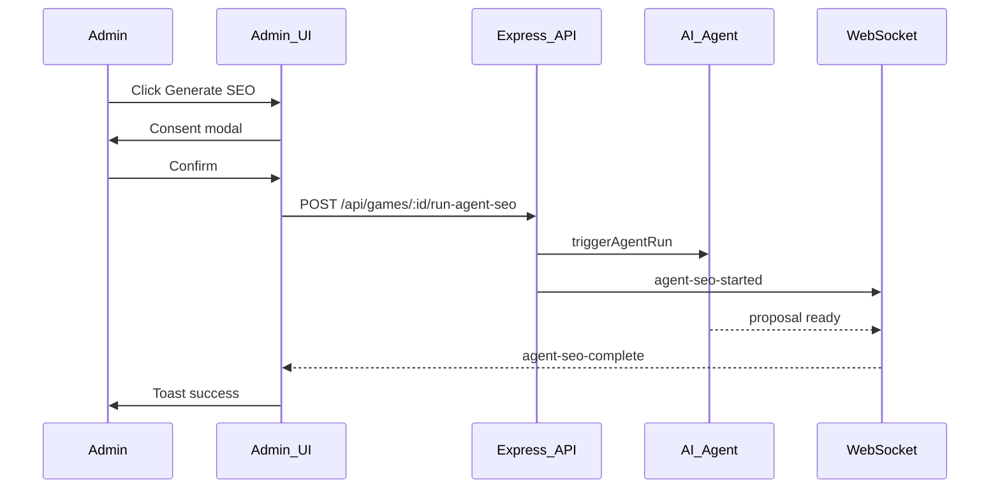

# Agent SEO — feature summary and test report

**Audience:** Tech lead / reviewer  
**Date:** 2026-06-01  
**Scope:** Admin UI for manual SEO generation + server auto/manual triggers + automated tests

---

## 1. Executive summary

This change adds **consent-gated “Generate SEO”** actions in the admin UI and hardens the **server-side agent SEO pipeline** with focused unit and integration tests.

| Area | What changed |
|------|----------------|
| **Edit Game** | Generate SEO moved to the footer (left); billing consent modal unchanged |
| **Game Management** | Per-row Sparkles action + same consent modal |
| **Server** | `scheduleAgentSeoForGame()` extracted for auto-trigger on admin game create |
| **Tests** | 7 Jest cases across controller + AI agent service |

Manual SEO results arrive as an **UPDATE proposal** for review; they are not applied directly to the live game record.

---

## 2. Product behavior

### 2.1 Who can trigger SEO

| Role | UI (Edit Game / Game list) | API `POST /games/:id/run-agent-seo` |
|------|----------------------------|-------------------------------------|
| Superadmin | Yes | Yes (`isAdmin` middleware) |
| Admin | Yes | Yes |
| Editor | No | No |
| Viewer | No | No |

### 2.2 Consent (billing)

Before any manual run, the admin must confirm [`GenerateSeoConfirmationModal`](Client/src/components/modals/GenerateSeoConfirmationModal.tsx), which states that the SEO agent incurs **additional charges** and that output is delivered as a **proposal**, not an in-form update.

### 2.3 Client flow (manual)



Shared hook: [`Client/src/hooks/useAgentSeoTrigger.ts`](../Client/src/hooks/useAgentSeoTrigger.ts)

- Listens for `agent-seo-complete` (dispatched from [`useWebSocket`](../Client/src/hooks/useWebSocket.ts))
- 5-minute client timeout with warning toast if completion event never arrives

### 2.4 Server triggers

| Trigger | When | Handler | WebSocket |
|---------|------|---------|-----------|
| **Auto** | Admin `createGame` succeeds (post-commit) | `scheduleAgentSeoForGame(gameId)` | None |
| **Manual** | `POST /games/:id/run-agent-seo` | `runAgentSeoOnGame` | `emitAgentSeoStarted` |

**Not auto-triggered:** Editor `createGame` path (creates a proposal only).

Agent payload (both paths):

```json
{ "game_id": "<uuid>", "submit_review": true }
```

Implementation: [`Server/src/services/aiAgent.service.ts`](../Server/src/services/aiAgent.service.ts) → `POST {AI_AGENT_INTERNAL_URL}/agent/run`

---

## 3. Files touched

### Client

| File | Purpose |
|------|---------|
| `Client/src/hooks/useAgentSeoTrigger.ts` | Shared trigger + consent + completion handling |
| `Client/src/pages/Admin/EditGame.tsx` | Footer button; uses hook |
| `Client/src/pages/Admin/Management/GameManagement.tsx` | Row Sparkles + modal; uses hook |

### Server

| File | Purpose |
|------|---------|
| `Server/src/controllers/gameController.ts` | `scheduleAgentSeoForGame`, `runAgentSeoOnGame` |
| `Server/src/routes/gameRoutes.ts` | Route registration (unchanged path) |
| `Server/src/controllers/__tests__/agentSeo.test.ts` | Controller/route tests |
| `Server/src/services/__tests__/aiAgent.service.test.ts` | HTTP client tests |

---

## 4. Test strategy

Tests follow existing Server patterns: **mock external I/O** (AI agent, WebSocket, storage, queues, DB transaction), use **supertest** mini-apps for HTTP-level checks.

### 4.1 How to run

```bash
cd Server
pnpm exec jest src/controllers/__tests__/agentSeo.test.ts src/services/__tests__/aiAgent.service.test.ts --runInBand
```

Expected: **2 suites, 7 tests, all passing**. See **[agent_seo_test_results.md](./agent_seo_test_results.md)** for the dedicated test results report.

### 4.2 Test matrix

| # | Suite | Type | Case | Asserts |
|---|-------|------|------|---------|
| 1 | `agentSeo.test.ts` | Unit | `scheduleAgentSeoForGame` success | `triggerAgentRun({ game_id, submit_review: true })` |
| 2 | `agentSeo.test.ts` | Unit | `scheduleAgentSeoForGame` agent failure | Does not throw; fire-and-forget logs only |
| 3 | `agentSeo.test.ts` | Unit | `runAgentSeoOnGame` success | 202 body; `emitAgentSeoStarted`; agent called |
| 4 | `agentSeo.test.ts` | Unit | `runAgentSeoOnGame` failure | `next(error)`; no 202; no WebSocket started |
| 5 | `agentSeo.test.ts` | Integration | `POST /games/:id/run-agent-seo` | Route → handler → 202 + agent payload |
| 6 | `agentSeo.test.ts` | Integration (negative) | Editor `POST /games` | 200 proposal response; **`scheduleAgentSeoForGame` not called** |
| 7 | `aiAgent.service.test.ts` | Unit | `triggerAgentRun` | `axios.post` to `{webhookUrl}/agent/run`, 10s timeout |

### 4.3 Mocks used (`agentSeo.test.ts`)

- `aiAgent.service` — `triggerAgentRun`
- `websocket.service` — `emitAgentSeoStarted` / `emitAgentSeoComplete`
- `fileUtils`, `slugify`, `cache-invalidation`, `queue`, `storage`, `aiNotification`
- `AppDataSource` — minimal query runner + repository stubs for editor `createGame` negative test

### 4.4 Explicitly out of test scope

| Item | Rationale |
|------|-----------|
| Full admin `createGame` → auto SEO E2E | Heavy DB/upload mocks; auto path covered by `scheduleAgentSeoForGame` unit tests + single call site in `createGame` |
| Real AI agent HTTP | Mocked; service layer has dedicated axios test |
| Client component/hook mount tests | Repo convention: Client Vitest targets logic, not UI mounts |
| Proposal approval applying `seoMeta` | Separate flow in `gameProposalController` |
| `agent-seo-complete` WebSocket payload | Existing client WebSocket hook; not part of this Server suite |

---

## 5. Review checklist for tech lead

- [ ] Admin/superadmin-only UI matches `isAdmin` route guard
- [ ] Consent modal shown on **every** manual trigger (Edit Game + list row)
- [ ] Auto SEO only on **admin** game create, not editor proposals
- [ ] Manual trigger emits `agent-seo-started`; auto does not (intentional)
- [ ] Agent failures on auto path do not fail the create response (fire-and-forget)
- [ ] Manual agent failures surface to client via API error (handler calls `next`)
- [x] Tests pass locally with command in §4.1 (see [agent_seo_test_results.md](./agent_seo_test_results.md) — 7/7 passed on 2026-06-01)

---

## 6. Suggested manual QA (staging)

1. **Edit Game** — As admin, click Generate SEO in footer → confirm modal → verify 202 and “Agent SEO job triggered” toast.
2. **Game Management** — Sparkles on a row → same modal → same behavior.
3. **Editor** — Confirm no Sparkles / footer SEO button.
4. **Create game (admin)** — New game created → verify agent job enqueued server-side (logs: `[agentSeo] Triggered SEO for game …`).
5. **Create game (editor)** — Proposal submitted → no auto SEO log for that flow.

---

## 7. Related references

- Route: `Server/src/routes/gameRoutes.ts` — `POST /:id/run-agent-seo`
- Swagger: `runAgentSeoOnGame` in `gameController.ts`
- Client API: `useRunAgentSeo` in `Client/src/backend/games.service.ts`

